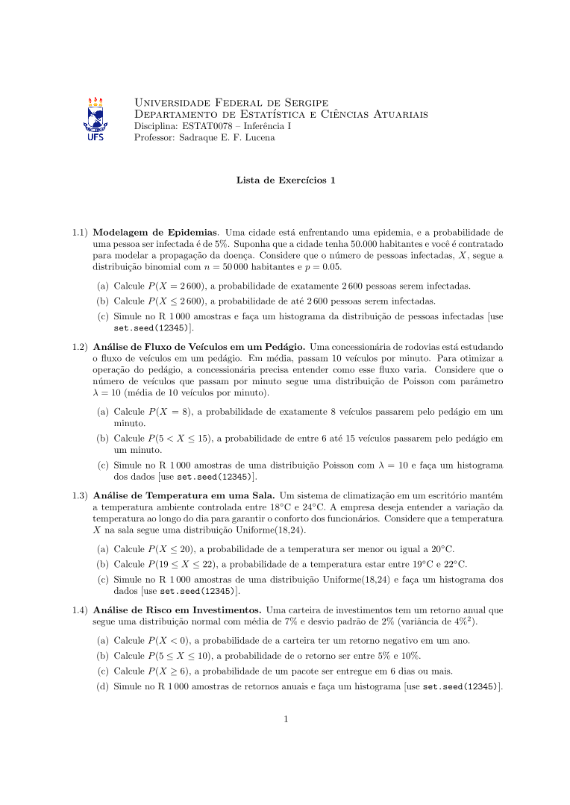

---

Sejam bem-vindos(as) à Inferência I!

Na primeira aula, traçamos nosso "plano de voo" para o semestre: conversamos sobre os objetivos da disciplina, os temas que vamos explorar, o formato das avaliações e os canais de comunicação. Para já aquecer os motores, mergulhamos em uma revisão fundamental de algumas das principais distribuições de probabilidade e cálculos práticos no R. Assim, preparamos o terreno para os desafios de estimação que vêm pela frente.

Slides:

:::: {.grid}

::: {.g-col-12 .g-col-md-4}

Versão HTML

:::

::: {.g-col-12 .g-col-md-4}

Versão PDF

:::

::::

---

Lista de Exercícios:

:::: {.grid}

::: {.g-col-12 .g-col-md-3}

:::

::::