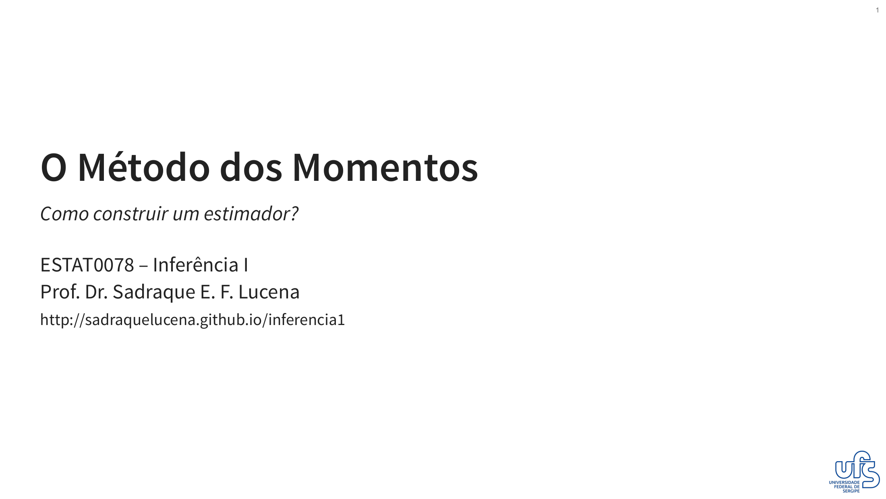

---

Nesta aula, apresentamos o primeiro método para a obtenção de estimadores: o Método dos Momentos. A lógica por trás deste método é intuitiva e elegante: ele postula que os momentos de uma amostra devem ser bons estimadores para os momentos correspondentes da população. Ao igualar essas quantidades, criamos um sistema de equações que nos permite encontrar estimadores para os parâmetros desconhecidos.

Slides:

:::: {.grid}

::: {.g-col-12 .g-col-md-4}

Versão HTML

:::

::: {.g-col-12 .g-col-md-4}

Versão PDF

:::

::::

---

Lista de Exercícios:

:::: {.grid}

::: {.g-col-12 .g-col-md-3}

:::

::::