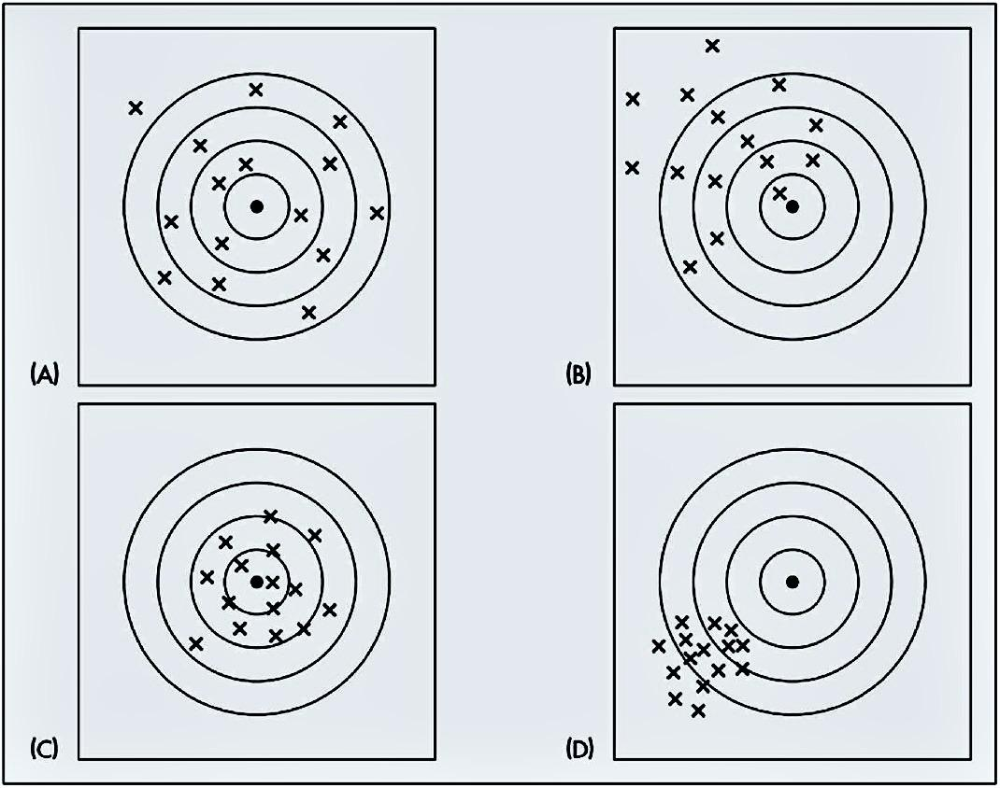
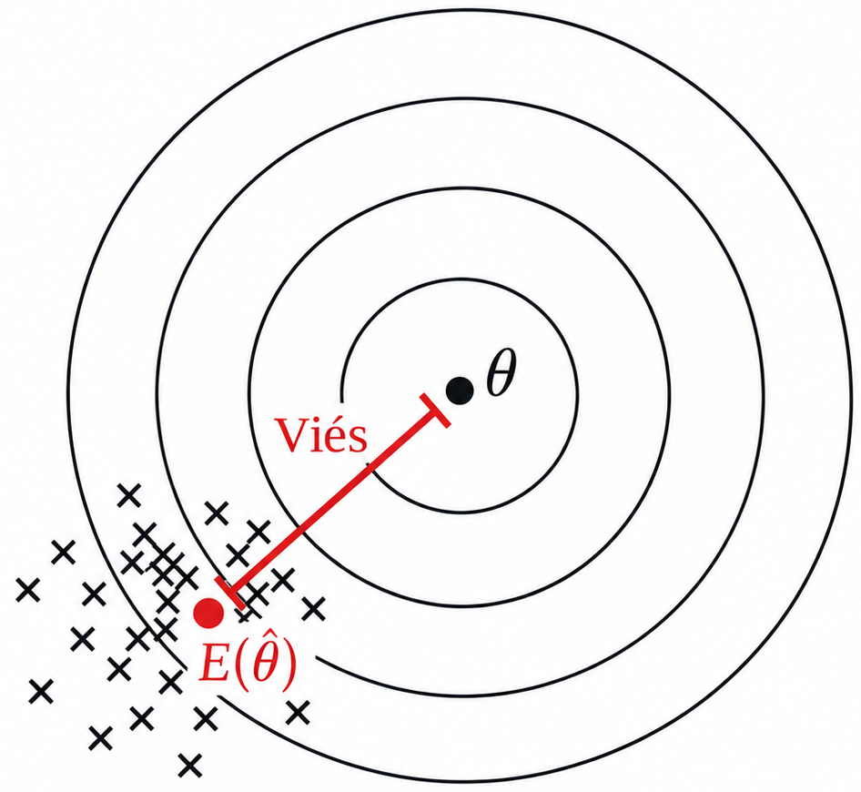

## 

- Na primeira unidade, aprendemos a **obter estimadores** para os parâmetros de uma distribuição de probabilidade por meio do **Método dos Momentos** e da **Máxima Verossimilhança**.

- Entretanto, o objetivo da estimação não é só encontrar uma expressão para um parâmetro desconhecido.
  - O que buscamos é obter uma **representação quantitativa do comportamento da população** por meio de seus parâmetros e assim fazer inferência sobre ela.

- Exemplos:

  - Estimar os parâmetros de uma distribuição para representar a frequência e a severidade dos sinistros da carteira de segurados e realizar estudos de risco e precificação.

  - Estimar parâmetros que representem a distribuição dos salários de empregados de uma empresa, para analisar a estrutura salarial e projetar custos futuros com pessoal.

- Em ambos os casos, observamos apenas uma **amostra**, mas nosso interesse está nas características da **população** que ela representa.

## 

- Obter um estimador é apenas o primeiro passo. Precisamos avaliar **como ele se comporta quando diferentes amostras da mesma população são observadas**.

- Um estimador pode ser mais ou menos adequado dependendo de características como:
  - **Viés:** indica se, em média, o estimador tende a se afastar do verdadeiro valor do parâmetro.
  - **Variância:** indica quanto as estimativas podem variar de uma amostra para outra.
  - **Erro Quadrático Médio:** combina o efeito do viés e da variância em uma única medida.
  - **Consistência:** verifica se o estimador se aproxima do verdadeiro parâmetro à medida que o tamanho da amostra aumenta.
  - **Eficiência:** permite comparar a precisão de diferentes estimadores, considerando sua variabilidade.

- Essas propriedades nos permitem **caracterizar e comparar o comportamento dos estimadores**, indo além da simples obtenção de uma fórmula.

- Nesta aula começaremos pelo **viés**.

## Visualização da ideia

* Na imagem abaixo, o **alvo** representa o **valor do parâmetro** e os "tiros" representam os diferentes valores amostrais da estatística de interesse.

:::: {.columns}

::: {.column width=40%}

:::

::: {.column width=60%}

* (A$\,\!$) e (C) fornecem valores distribuídos em torno do verdadeiro valor do parâmetro, embora em (A) os valores estejam mais dispersos.
* Em (B) e (D) as estimativas estão centradas em torno de um valor diferente do parâmetro de interesse e na parte (D), a dispersão é menor.
:::

::::

## Definição 6.1: Viés de um estimador

- O viés (ou vício) de um estimador é a diferença entre o valor esperado do estimador e o verdadeiro valor do parâmetro:
$$
  B(\widehat{\theta}) = E[\widehat{\theta}] - \theta.
$$
  
- Ele mede a distância do centro da distribuição amostral em relação ao verdadeiro valor do parâmetro.

:::: {.columns}

::: {.column width=30%}
{width="70%"}
:::

::: {.column width=70%}

- $B(\widehat{\theta})>0$: o estimador tende a **superestimar** $\theta$.

- $B(\widehat{\theta})<0$: o estimador tende a **subestimar** $\theta$.

- $B(\widehat{\theta})=0$: o estimador **não é viesado**, pois $E[\widehat{\theta}] = \theta$.
:::

::::

## Revisão: Esperança Matemática

-   Se $X$ é uma v.a. discreta e $Y$ é uma v.a. contínua, a esperança é dada por
$$
  E(X) = \sum_{i} x_i P(X=x_i) \quad \text{e} \quad E(Y) = \int\limits_{-\infty}^{\infty} y\, f(y) \, dy.
$$

- Para variáveis aleatórias $X$ e $Y$ e constantes $a$ e $b$:
  - $E(a+bX) = a + b E(X)$
  - $E(X+Y) = E(X) + E(Y)$
  - Se $X$ e $Y$ forem independentes, $E(XY) = E(X)E(Y)$.

- Essas propriedades valem para mais de duas variáveis aleatórias.

## Revisão: Variância

$$
  \begin{aligned}
    Var(X) &= E[(X-E(X))^2] = E(X^2) - [E(X)]^2.
  \end{aligned}
$$

- Para variáveis aleatórias $X$ e $Y$ e constantes $a$ e $b$:
  - $Var(a+bX) = b^2 Var(X)$
  - Se $X$ e $Y$ são independentes, $Var(X+Y) = Var(X)+Var(Y)$

- Essas propriedades valem para mais de duas variáveis aleatórias.

## Exemplo 6.1

Seja $X_1, X_2, \ldots, X_n$ uma amostra aleatória independente e identicamente distribuída de uma população com $E(X)=\mu$ e $Var(X)=\sigma^2$. Considere que o estimador de máxima verossimilhança de $\mu$ é $\overline{X} = \frac{1}{n}\sum_{i=1}^n X_i$. $\overline{X}$ é viesado para $\mu$?

## Exemplo 6.2

Considere novamente uma amostra aleatória de uma população com $E(X)=\mu$ e $Var(X)=\sigma^2$. Considere os estimadores

$$
\widehat{\sigma}^2 = \frac{1}{n} \sum_{i=1}^n (X_i-\overline{X})^2 \qquad\text{e}\qquad S^2 = \frac{1}{n-1} \sum_{i=1}^n (X_i-\overline{X})^2.
$$

Qual deles é não viesado para $\sigma^2$?

- *Dica: considere a identidade* $\sum_{i=1}^n (X_i-\overline{X})^2 = \sum_{i=1}^n (X_i-\mu)^2 - n (\overline{X}-\mu)^2$.    

## Definição 6.2: Estimador Assintoticamente Não Viesado

- Alguns estimadores, embora sejam viesados para amostras finitas, apresentam viés que tende a zero à medida que $n$ aumenta.

- Esse estimador é chamado de **assintoticamente não viesado**.

- **Definição formal:** Seja $\widehat{\theta}$ um estimador de um parâmetro desconhecido $\theta$. Dizemos que $\widehat{\theta}$ é um estimador assintoticamente não viesado para $\theta$ se
$$
  \lim_{n\rightarrow\infty} E(\widehat{\theta}) = \theta,
$$
ou, de forma equivalente,
$$
  \lim_{n\rightarrow\infty} B(\widehat{\theta}) = \lim_{n\rightarrow\infty} \left[ E(\widehat{\theta}) - \theta \right] = 0.
$$

## Exemplo 6.3
Seja $X_1, X_2, \ldots, X_n$ uma amostra aleatória independente e identicamente distribuída de uma população com $E(X)=\mu$ e $Var(X)=\sigma^2>0$.
    
a) $\overline{X}$ é assintoticamente não viesado para $\mu$?
b) $\widehat{\sigma}^2$ é assintoticamente viesado para $\sigma^2$?
c) $S^2$ é assintoticamente viesado para $\sigma^2$?

## Resumo

Para um estimador $\widehat{\theta}$ de $\theta$, o viés é dado por

$$
B(\widehat{\theta}) = E_\theta(\widehat{\theta})-\theta
$$

e $\widehat{\theta}$ é não viesado se
$$
E_\theta(\widehat{\theta})=\theta, \quad \forall\,\theta\in\Theta.
$$

- Alguns estimadores podem ser viesados, mas apresentar um viés que tende a zero à medida que $n$ aumenta.

- A avaliação de um estimador, *não depende apenas do viés*. Também precisamos considerar sua *variabilidade* e outras propriedades que serão estudadas ao longo desta unidade.

# Fim