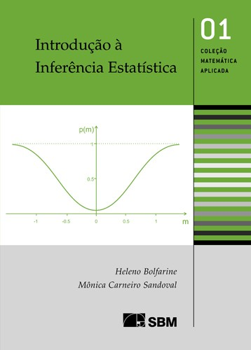
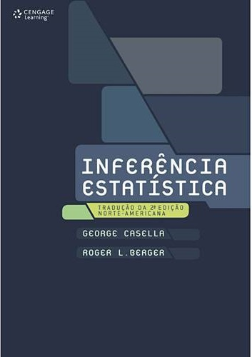
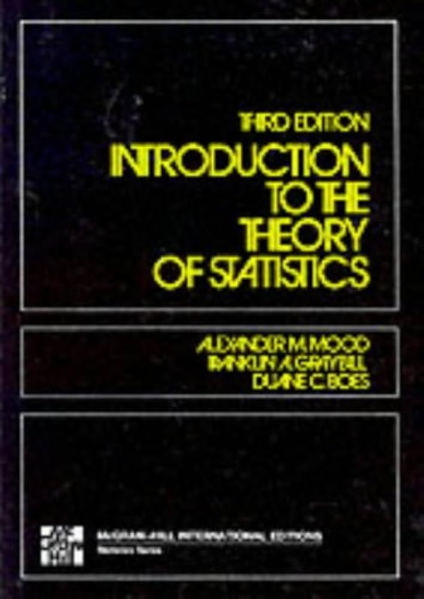
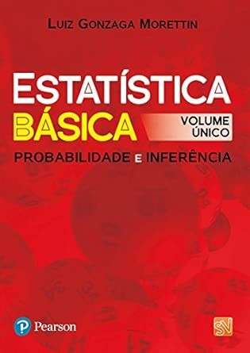
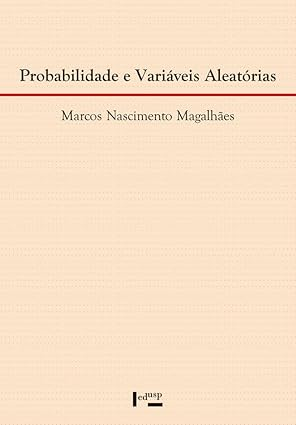
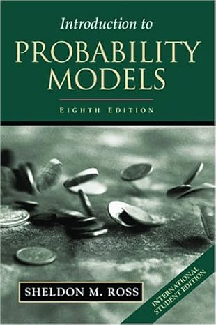
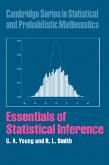
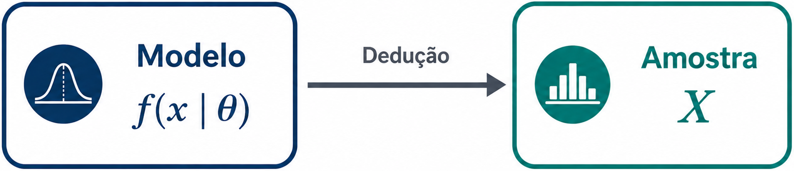
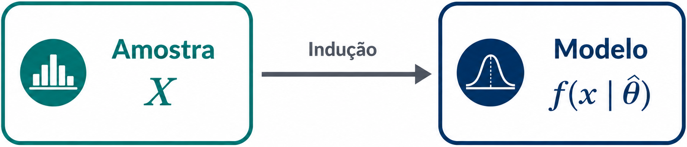
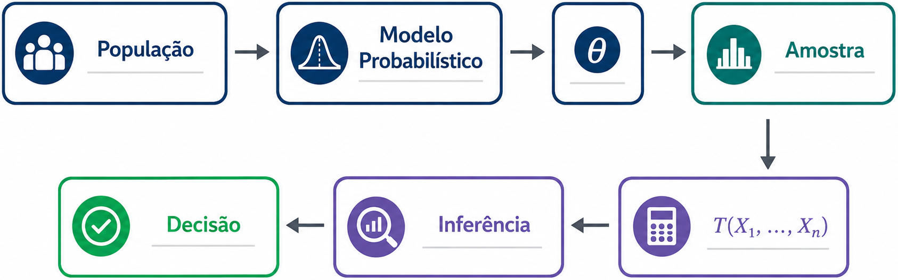

## Canais de Comunicação e Materiais da Disciplina

- Site: <http://sadraquelucena.github.io/inferencia1>

- Grupo no WhatsApp: <http://tiny.cc/inf1262>

{fig-align="center"}

## Informações da disciplina

- **Componente curricular:** ESTAT0078 -- Inferência I
- **Período:** 4º semestre
- **Carga horária:** 60 horas (4 créditos)
- **Horário:**
  - Terças - 19h00 às 20h30
  - Quintas - 20h45 às 22h15
- **Docente:** Prof. Dr. Sadraque E. F. Lucena

## Mapa da Disciplina: Para Onde Vamos?

 

  

1. Como os dados chegam até nós?
2. Como obter um estimador?
3. Como saber se um estimador é bom?
4. Qual é o melhor estimador possível?
5. Como quantificar a incerteza da estimação?

## Objetivo da Disciplina

- **Construir** estimadores para parâmetros populacionais;
- **Avaliar** a qualidade de procedimentos de estimação;
- **Interpretar** estimativas e seus níveis de incerteza;
- **Compreender** os fundamentos probabilísticos da estimação;
- **Reconhecer** as propriedades teóricas dos estimadores;
- **Aplicar** métodos de estimação em problemas científicos.

## Ementa

- Amostras e distribuições amostrais.

- Estimação pontual e por intervalo.

- Estudo de estimadores mais comumente usados: método dos momentos, máxima verossimilhança, estimador de Bayes.

- Intervalos de confiança; métodos para construção de intervalos de confiança.

## Conteúdo Programático

### Parte 1. Fundamentos da Inferência Estatística 
*Como os dados chegam até nós?*

- Inferência estatística e tomada de decisão
- População, amostra, parâmetro e estatística
- Variabilidade amostral
- Distribuições amostrais
- Introdução ao problema da estimação

## Conteúdo Programático

### Parte 2. Construção de Estimadores 
*Como obter um estimador?*

- Conceitos de estimador e estimativa
- Método dos Momentos
- Método da Máxima Verossimilhança
- Introdução à Inferência Bayesiana

## Conteúdo Programático

### Parte 3. Avaliação de Estimadores 
*Como saber se um estimador é bom?*

- Viés
- Variância
- Erro Quadrático Médio
- Consistência
- Eficiência
- Informação de Fisher
- Limite de Cramér--Rao

## Conteúdo Programático

### Parte 4. Estrutura Teórica da Estimação 
*Qual é o melhor estimador possível?*

- Estatísticas suficientes
- Critério da fatoração de Neyman--Fisher
- Família exponencial
- Completude
- Estimadores de Variância Uniformemente Mínima

## Conteúdo Programático

### Parte 5. Estimação por Intervalos 
*Como quantificar a incerteza da estimação?*

- Quantidades pivotais
- Intervalos de confiança exatos
- Intervalos de confiança assintóticos
- Introdução aos métodos computacionais de construção de intervalos (*Bootstrap*)

## Avaliação

- Serão realizadas **3 avaliações**.
- A aprovação requer uma média maior ou igual a 5,0.
- Uma **avaliação substitutiva** será realizada ao final do período. Esta prova abrange todo o conteúdo, substitui apenas uma nota e é permitida em dois casos:
  1. Para repor falta em alguma das avaliações.
  2. Para substituir a menor nota (apenas para quem tiver média inferior a 5,0).

## Datas Importantes

::: {.callout-note title="Avaliações (previsão):"}

- **24/Set/26 (quinta):** Avaliação 1
- **03/Nov/26 (quinta):** Avaliação 2
- **08/Dez/26 (terça):** Avaliação 3
- **15/Dez/26 (quinta):** Avaliação Substitutiva
:::

::: {.callout-important title="Não haverá aula:"}

- **08/Set/2026:** Dia de N. Sra. da Vitória, padroeira de São Cristóvão
(feriado municipal)
- **24 e 26/Nov/25:** XII SEMAC
:::

## Bibliografia Recomendada

### Básica 
::: {.columns}
::: {.column width="25%"}
{height=13cm}
:::
::: {.column width="25%"}
{height=13cm}
:::
::: {.column width="25%"}
{height=13cm}
:::
::: {.column width="25%"}
{height=13cm}
:::
:::

## Bibliografia Recomendada

### Complementar 
::: {.columns}
::: {.column width="25%"}
{height=13cm}
:::
::: {.column width="25%"}
{height=13cm}
:::
::: {.column width="25%"}
{height=13cm}
:::
::: {.column width="25%"}
{height=13cm}
:::
:::

# Da Probabilidade à Inferência Estatística

## O Paradigma da Probabilidade

- Nos estudos de Probabilidade, a distribuição probabilística da população é **completamente conhecida**.
  - A função de probabilidade ou de densidade $f(x \mid \theta)$ é especificada.
  - O parâmetro $\theta$ da distribuição é conhecido.
  - A única fonte de aleatoriedade é a **amostra futura**.

  

- **Objetivo:** determinar probabilidades associadas ao comportamento de uma amostra aleatória.

## O Paradigma da Probabilidade
### Exemplo: Ocorrência de Sinistros

- Assume-se que o número anual de sinistros de uma apólice segue uma distribuição de Poisson com média λ = 0,25 sinistros por ano, $X\sim \text{Poisson}(\lambda=0{,}25)$.

- A partir desse modelo, é possível calcular:
  - a probabilidade de uma apólice não registrar sinistros: $P(X=0)$;
  - a probabilidade de ocorrer pelo menos um sinistro: $P(X\geq 1)$;
  - a probabilidade de uma carteira com milhares de apólices registrar mais de determinado número de sinistros.
- Em todos esses casos, a distribuição de probabilidade é conhecida e o objetivo é prever o comportamento de perdas futuras.

## O Paradigma da Probabilidade
### Exemplo: Predição de Internações

- Uma equipe resolve prever o tempo de permanência hospitalar de pacientes internados por complicações do diabetes usando a distribuição Lognormal, $T \sim \text{Lognormal}(\mu,\sigma^2)$.
- Esse modelo permite determinar:
  - a probabilidade de uma internação durar mais de 15 dias;
  - o tempo médio esperado de ocupação dos leitos;
  - a proporção de pacientes com internações prolongadas;
  - a capacidade hospitalar necessária para atender à demanda prevista.

- Como a distribuição de probabilidade é completamente conhecida, é possível prever a utilização futura dos recursos hospitalares.

# O Paradigma da Inferência Estatística

- Já nos problemas de Inferência Estatística, a distribuição probabilística da população **não é completamente conhecida**.
  - A forma da distribuição pode ser conhecida ou assumida, mas o parâmetro $\theta$ é desconhecido.
  - Observa-se apenas uma amostra $(x_1,\ldots,x_n)$ proveniente da população.
  - A fonte de informação passa a ser os **dados observados**.

  

- **Objetivo:** utilizar a amostra para aprender sobre a população e estimar o parâmetro desconhecido $\theta$.

## O Paradigma da Inferência Estatística
### Exemplo: Estimativa da Ocorrência de Sinistros

- Uma seguradora deseja estimar a frequência anual de sinistros de uma nova carteira de seguros, assumindo a distribuição de Poisson,
$X\sim \text{Poisson}(\lambda)$, mas o parâmetro $\lambda$ é desconhecido.
- Observa-se milhares de apólices e obtém-se uma amostra histórica de sinistros.
- A partir dessa amostra, é possível:
  - estimar a frequência média de sinistros (estimativa de $\lambda$);
  - construir intervalos de confiança para a estimativa de $\lambda$;
  - testar hipóteses sobre mudanças na frequência;
  - definir um prêmio compatível com o risco observado.
- Agora os dados vêm primeiro e o modelo é aprendido posteriormente.

## O Paradigma da Inferência Estatística
### Exemplo: Predição de Internações

- Um hospital deseja conhecer o tempo médio de permanência de pacientes internados por diabetes. Assume-se $T\sim \text{Lognormal}(\mu,\sigma^2)$, mas os parâmetros $\mu$ e $\sigma^2$ são desconhecidos.
- Após coletar uma amostra de pacientes internados, torna-se possível
  - estimar o tempo médio de permanência $\mu$;
  - estimar a variabilidade entre pacientes $\sigma^2$;
  - construir intervalos de confiança para essas estimativas;
  - avaliar se houve mudança após uma intervenção clínica.
- Perceba que o modelo que busca replicar o comportamento da população é ajustado utilizando os dados observados.

## Paradigmas

### Probabilidade

  

### Inferência Estatística

  

# Elementos do Problema Inferencial

## Os Elementos da Inferência Estatística

- Todo problema de Inferência Estatística é composto por cinco elementos fundamentais:

| Elemento              | Papel                                    |
| --------------------- | ---------------------------------------- |
| População             | Origem dos dados                         |
| Modelo probabilístico | Representação matemática da população    |
| Parâmetro             | Característica desconhecida da população |
| Amostra               | Informação disponível                    |
| Inferência            | Processo de aprender sobre o parâmetro   |

## População e Modelo Probabilístico

- Uma população corresponde ao conjunto de unidades sobre as quais se deseja obter informações.
- Entretanto, em Estatística Matemática, a população é representada por um **modelo probabilístico**, que descreve matematicamente o comportamento da variável de interesse.
- Exemplos:
  - Tempo até um sinistro;
  - Valor de indenizações;
  - Número de internações;
  - Renda mensal.

## População e Modelo Probabilístico

- Considere uma população descrita por uma característica $X$.
- Assume-se que sua distribuição seja dada por $f(x\mid\theta)$, em que $\theta$ representa um ou mais parâmetros desconhecidos da população:

| Modelo      | Parâmetro      |
| :----------- | :--------------: |
| Bernoulli   | $p$            |
| Poisson     | $\lambda$      |
| Normal      | $\mu,\sigma^2$ |
| Exponencial | $\alpha$       |

- A Inferência Estatística busca aprender sobre esses parâmetros.

## Amostra Aleatória

- Como a população completa geralmente não pode ser observada, obtém-se uma amostra aleatória composta por $n$ observações independentes e identicamente distribuídas segundo o mesmo modelo probabilístico da população.
- Formalmente, uma amostra aleatória de tamanho $n$ é definida como o vetor de variáveis aleatórias $(X_1,\ldots,X_n)$, em que

  - $X_1,\ldots,X_n$ são idependentes;
  - cada $X_i$ possui a mesma distribuição de $X$.
- Após a coleta dos dados, observa-se uma realização particular dessa amostra, $$\mathbf{x}=(x_1,\ldots,x_n),$$ que é toda a informação disponível sobre a população.

## Estatísticas

- As informações contidas na amostra são resumidas por funções matemáticas denominadas **estatísticas**.
- Uma estatística é qualquer função da amostra que não depende de parâmetros desconhecidos, $T=T(X_1​, \ldots,X_n​)$.
- Entre as estatísticas mais utilizadas, temos:

:::: {.columns}
::: {.column width="4%"}
  
:::
::: {.column width="40%"}
  - Média amostral;
  - Variância amostral;
  - Mediana;
:::

::: {.column width="50%"}
  - Mínimo e máximo;
  - Proporções amostrais.
:::

::::

- Essas quantidades são a base para praticamente todos os procedimentos inferenciais desenvolvidos ao longo da disciplina.

## Estimadores e Estimativas

- Na maioria dos problemas de Inferência Estatística, o objetivo consiste em determinar um valor plausível para um parâmetro desconhecido da população.
- Uma estatística utilizada especificamente para aproximar um parâmetro é denominada **estimador**.
  - Se $\theta$ epresenta um parâmetro populacional, um estimador é uma estatística $\widehat{\theta} = T(X_1,\ldots,X_n)$.
  - Após observar uma amostra específica, o estimador assume um valor numérico, $\widehat{\theta} = T(x_1,\ldots,x_n)$, denominado **estimativa**.

- Portanto:
  - **estimador** é uma variável aleatória;
  - **estimativa** é o valor observado do estimador.

## Objetivos da Inferência Estatística

- Os métodos de Inferência Estatística procuram responder, essencialmente, a dois tipos de questões:
  1. Estimação pontual e intervalar de parâmetros (estimar os valores dos parâmetros desconhecidos da população).
  2. Testes de hipóteses (avaliar se afirmações sobre os parâmetros populacionais são verdadeiras).
- Grande parte das técnicas estudadas posteriormente, como máxima verossimilhança, intervalos de confiança e testes estatísticos, são desenvolvidas para resolver um desses dois problemas.

## Síntese

- O processo inferencial pode ser resumido pela sequência lógica:

  

# Fim