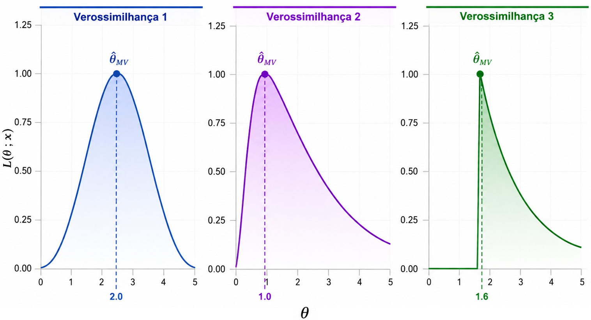

## No Método dos Momentos

Considere uma amostra aleatória $X_1,\ldots,X_n \stackrel{iid}{\sim} f(x;\theta)$, com $\theta\in\Theta$. Aqui, os estimadores são obtidos por meio da correspondência entre momentos populacionais e momentos amostrais:
$$
\mu'_k = E(X^k) \quad \longleftrightarrow \quad M'_k = \frac{1}{n}\sum\limits_{i=1}^n X_i^k.
$$

Se desejamos estimar um único parâmetro, o estimador é obtido como solução de
$$
E(X) = \overline{X}.
$$

- Já no **Método da Máxima Verossimilhança**, a pergunta muda: **qual é o valor de $\theta$ mais provável de ter gerado a amostra que observamos?**


## Distribuição conjunta de uma amostra

Seja $$X_1,\ldots,X_n \stackrel{iid}{\sim} f(x;\theta), \quad \theta\in\Theta.$$

Como há independência, a distribuição conjunta da amostra é o produto das funções de probabilidade (ou densidades) individuais:
$$f(x_1, \ldots, x_n;\theta) = \prod\limits_{i=1}^n f(x_i;\theta).$$

- **Visão da Probabilidade:** O valor de $\theta$ é conhecido/fixo e avaliamos o comportamento/probabilidade de diferentes valores aleatórios $(x_1, \ldots, x_n)$.


## Função de Verossimilhança ($L$)

No método da máxima verossimilhança a mesma funão passa a se chamar **Função de verossimilhança**:
$$
L(\theta;\mathbf{x}) = \prod\limits_{i=1}^n f(x_i;\theta), \quad \theta\in\Theta.
$$


- **O que muda:** Agora, os valores de $\mathbf{x} = (x_1,\ldots,x_n)$ são constantes (pois a amostra já foi observada) e a variável é o parâmetro $\theta$.


## Método da Máxima Verossimilhança

O Método da Máxima Verossimilhança consiste em escolher o valor de θ∈Θ que maximiza a verossimilhança da amostra observada, ou seja, o valor de θ que torna os dados observados mais compatíveis com o modelo.

- Matematicamente: $\qquad\quad \widehat{\theta}_{\text{MV}} = \underset{\theta \in \Theta}{\arg\max} \, L(\theta; \mathbf{x})$

<p align="center">
  
</p>


## Encontrando o Máximo da Função de Verossimilhança

Para encontrar o valor de $\theta$ que maximiza a função de verossimilhança $L(\theta)$, usamos as ferramentas clássicas do Cálculo:

1. **Encontrar os pontos críticos:** calcular a 1ª derivada e resolver $L'(\theta)=0.$
2. **Verificar se é um máximo:** avaliar a 2ª derivada no ponto crítico $L(\widehat{\theta})<0.$

- Como a função de verossimilhança
$$
L(\theta;\mathbf{x}) = \prod\limits_{i=1}^n f(x_i;\theta)
$$
 é um produtório de $n$ termos, sua derivada é quase impossível de resolver analiticamente.


## Solução: Função de Log-Verossimilhança ($\ell$)

$$\ell(\theta;\mathbf{x}) = \log L(\theta;\mathbf{x}) = \log\left[\prod\limits_{i=1}^n f(x_i;\theta)\right] = \sum_{i=1}^n \log f(x_i;\theta)$$

A função de log-verossimilhança tem duas vantagens principais: $\left(\prod\limits_{i=1}^n \longrightarrow \sum\limits_{i=1}^n\right)$

1. Como o logaritmo é uma função estritamente crescente, o valor de $\theta$ que maximiza $L(\theta;\mathbf{x})$ é exatamente o mesmo que maximiza $\ell(\theta;\mathbf{x})$.
2. É muito mais simples derivar uma soma do que um produto. O que facilita encontrarmos o ponto de máximo.

A equação que será resolvida passa de $L'(\theta)=0$ para $\ell'(\theta)=0$.


## Procedimento para Obtenção do EMV

1. Construção da função de verossmilhança $L(\theta;\mathbf{x})$
2. Obtenção da log-verossimilhança $\ell(\theta;\mathbf{x})$
3. Calcular $\ell'(\theta;\mathbf{x})$ (chamada de função score)
4. Resolver $\ell'(\theta;\mathbf{x}) = 0$ para achar o(s) ponto(s) crítico(s)
5. Confirmar se $\ell''(\widehat{\theta};\mathbf{x}) < 0$ para garantir que $\widehat{\theta}$ é ponto de máximo


## Exemplo 3.1

Seja $X_1, \ldots, X_n \stackrel{\text{iid}}{\sim} \text{Bernoulli}(p)$, com $p \in (0, 1)$ e $f(x; p) = p^x (1-p)^{1-x}$ para $x \in \{0, 1\}$. Determine o estimador de máxima verossimilhança (EMV) para $p$.

::: {.fragment}
<br>
Suponha que observamos a amostra:

```{r}
#| echo: false
#| fig-width: 10
#| fig-height: 5

library(ggplot2)
library(patchwork)

set.seed(123)

n <- 50

p <- 0.7

x <- rbinom(
  n,
  size = 1,
  prob = p
)

sucessos <- sum(x)

fracassos <- n - sucessos

p_hat <- mean(x)

# ============================================================
# Painel 1 — Dados observados
# ============================================================

dados_obs <- data.frame(
  resultado = factor(
    c(0, 1),
    levels = c(0, 1),
    labels = c("Fracasso (0)", "Sucesso (1)")
  ),
  frequencia = c(fracassos, sucessos)
)

grafico_dados <- ggplot(
  dados_obs,
  aes(x = resultado, y = frequencia)
) +

  geom_col(
    fill = "#5B9BD5",
    color = "#1F4E79",
    width = 0.65
  ) +

  geom_text(
    aes(label = frequencia),
    vjust = -0.5,
    size = 6,
    color = "#1F4E79"
  ) +

  labs(
    title = "Amostra observada",
    subtitle = paste0(
      sucessos, " sucessos e ",
      fracassos, " fracassos"
    ),
    x = NULL,
    y = "Frequencia"
  ) +

  scale_y_continuous(
    limits = c(0, max(dados_obs$frequencia) + 5),
    breaks = seq(
      0,
      max(dados_obs$frequencia) + 5,
      by = 5
    )
  ) +

  theme_minimal(base_size = 16) +

  theme(
    panel.grid.minor = element_blank(),
    panel.grid.major.x = element_blank(),
    panel.grid.major.y = element_line(
      color = "#D9E6F2",
      linewidth = 0.4
    ),
    axis.title = element_text(color = "#1F4E79"),
    axis.text = element_text(color = "#333333"),
    plot.title = element_text(
      color = "#1F4E79",
      face = "bold"
    )
  )

# ============================================================
# Painel 2 — Funcao de verossimilhanca
# ============================================================

p_seq <- seq(
  0.001,
  0.999,
  length.out = 1000
)

L <- p_seq^sucessos *
  (1 - p_seq)^fracassos

verossimilhanca <- data.frame(
  p = p_seq,
  L = L
)

L_max <- p_hat^sucessos *
  (1 - p_hat)^fracassos

grafico_verossimilhanca <- ggplot(
  verossimilhanca,
  aes(x = p, y = L)
) +

  geom_line(
    color = "#0B2E59",
    linewidth = 1.3
  ) +

  geom_vline(
    xintercept = p_hat,
    linetype = "dashed",
    color = "#C55A11",
    linewidth = 0.9
  ) +

  geom_point(
    aes(
      x = p_hat,
      y = L_max
    ),
    color = "#C55A11",
    size = 4
  ) +

  annotate(
    "text",
    x = p_hat - .4,
    y = L_max,
    label = paste0(
      "EMV: ~hat(p) == ",
      round(p_hat, 2)
    ),
    parse = TRUE,
    color = "#C55A11",
    size = 5,
    hjust = 0
  ) +

  labs(
    title = "Funcao de verossimilhanca",
    subtitle = bquote(
      L(p) == p^.(sucessos) * (1-p)^.(fracassos)
    ),
    x = expression(p),
    y = expression(L(p))
  ) +

  theme_minimal(base_size = 16) +

  theme(
    panel.grid.minor = element_blank(),
    panel.grid.major.x = element_blank(),
    panel.grid.major.y = element_line(
      color = "#D9E6F2",
      linewidth = 0.4
    ),
    axis.title = element_text(color = "#1F4E79"),
    axis.text = element_text(color = "#333333"),
    plot.title = element_text(
      color = "#1F4E79",
      face = "bold"
    )
  )

# ============================================================
# Junta os dois graficos
# ============================================================

grafico_dados + grafico_verossimilhanca
```
:::


## Exemplo 3.2

Seja $X_1, \ldots, X_n \stackrel{\text{iid}}{\sim} \text{Exp}(\theta)$, com $f(x; \theta) = \frac{1}{\theta} e^{-x/\theta}$. Encontre o EMV de $\theta$.

::: {.fragment}
<br>
Suponha que observamos a amostra:

```{r}
#| echo: false
#| fig-width: 10
#| fig-height: 5

library(ggplot2)
library(patchwork)

# ============================================================
# Amostra observada
# ============================================================

set.seed(123)

n <- 40

# Amostra exponencial com média aproximadamente 2
x <- rexp(n, rate = 1 / 2)

soma_x <- sum(x)
media_x <- mean(x)

theta_hat <- media_x

# Intervalos definidos pela função hist()
h <- hist(
  x,
  breaks = "Sturges",
  plot = FALSE
)

# ============================================================
# Painel 1 — Dados observados
# ============================================================

grafico_dados <- ggplot(
  data.frame(x = x),
  aes(x = x)
) +

  geom_histogram(
    aes(y = after_stat(density)),
    breaks = h$breaks,
    fill = "#5B9BD5",
    color = "#1F4E79",
    linewidth = 0.6
  ) +

  geom_vline(
    xintercept = theta_hat,
    linetype = "dashed",
    color = "#C55A11",
    linewidth = 0.9
  ) +

  annotate(
    "text",
    x = theta_hat + 0.25,
    y = Inf,
    label = "Media amostral",
    color = "#C55A11",
    size = 5,
    vjust = 1.5,
    hjust = 0
  ) +

  labs(
    title = "Amostra observada",
    subtitle = paste0(
      "n = ", n,
      " observacoes"
    ),
    x = "Valores observados",
    y = "Densidade"
  ) +

  theme_minimal(base_size = 16) +

  theme(
    panel.grid.minor = element_blank(),
    panel.grid.major.x = element_blank(),
    panel.grid.major.y = element_line(
      color = "#D9E6F2",
      linewidth = 0.4
    ),
    axis.title = element_text(color = "#1F4E79"),
    axis.text = element_text(color = "#333333"),
    plot.title = element_text(
      color = "#1F4E79",
      face = "bold"
    )
  )

# ============================================================
# Painel 2 — Função de verossimilhança
# ============================================================

theta <- seq(
  max(0.05, min(x) / 2),
  max(x) * 2,
  length.out = 1000
)

# L(theta) = theta^(-n) * exp(-sum(x_i)/theta)
L <- theta^(-n) * exp(-soma_x / theta)

verossimilhanca <- data.frame(
  theta = theta,
  L = L
)

L_max <- theta_hat^(-n) *
  exp(-soma_x / theta_hat)

grafico_verossimilhanca <- ggplot(
  verossimilhanca,
  aes(x = theta, y = L)
) +

  geom_line(
    color = "#0B2E59",
    linewidth = 1.3
  ) +

  geom_vline(
    xintercept = theta_hat,
    linetype = "dashed",
    color = "#C55A11",
    linewidth = 0.9
  ) +

  geom_point(
    aes(
      x = theta_hat,
      y = L_max
    ),
    color = "#C55A11",
    size = 4
  ) +

  annotate(
  "text",
  x = theta_hat + 1,
  y = L_max,
  label = paste0(
    "'EMV: ' ~ hat(theta) == ",
    round(theta_hat, 2)
  ),
  parse = TRUE,
  color = "#C55A11",
  size = 5,
  hjust = 0
) +

  labs(
    title = "Funcao de verossimilhanaa",
    subtitle = expression(
      L(theta) == theta^{-n} * e^{-sum(x[i])/theta}
    ),
    x = expression(theta),
    y = expression(L(theta))
  ) +

  theme_minimal(base_size = 16) +

  theme(
    panel.grid.minor = element_blank(),
    panel.grid.major.x = element_blank(),
    panel.grid.major.y = element_line(
      color = "#D9E6F2",
      linewidth = 0.4
    ),
    axis.title = element_text(color = "#1F4E79"),
    axis.text = element_text(color = "#333333"),
    plot.title = element_text(
      color = "#1F4E79",
      face = "bold"
    )
  )

# ============================================================
# Junta os dois gráficos
# ============================================================

grafico_dados + grafico_verossimilhanca
```
:::


## Exemplo 3.3

Considere uma variável aleatória discreta $X \in \{1, 2\}$ com a seguinte Função de Probabilidade:
$$
P(X = x; \theta) = \theta^{2 - x} (1 - \theta)^{x - 1}, \quad \text{para } x \in \{1, 2\} \text{ e } 0 < \theta < 1
$$

- Se $x = 1 \implies P(X = 1) = \theta$
- Se $x = 2 \implies P(X = 2) = 1 - \theta$

Dada uma amostra aleatória $X_1, \dots, X_n \stackrel{\text{iid}}{\sim} P(X = x; \theta)$, obtenha o EMV de $\theta$.


## Exemplo 3.4

Considere uma amostra aleatória $X_1, \ldots, X_n \stackrel{\text{iid}}{\sim} \text{Cauchy}(\theta, 1)$, onde $\theta \in \mathbb{R}$ é o parâmetro de localização (desconhecido). A função de densidade é dada por:$$f(x; \theta) = \frac{1}{\pi \left[ 1 + (x - \theta)^2 \right]}, \quad x \in \mathbb{R}$$


- Log-Verossimilhança: $\quad \ell(\theta; \mathbf{x}) = -n \ln \pi - \sum_{i=1}^n \ln \left[ 1 + (x_i - \theta)^2 \right]$
- Função Score: $\quad U(\theta; \mathbf{x}) = \frac{d}{d\theta}\ell(\theta; \mathbf{x}) = \sum_{i=1}^n \frac{2(x_i - \theta)}{1 + (x_i - \theta)^2} = 0$
- Não é possível isolar $\theta$ na equação $U(\theta; \mathbf{x}) = 0$. A solução exige o uso de algoritmos numéricos de otimização (como Newton-Raphson ou BFGS).


## Exemplo 3.4

```{r}
#| echo: true
#| fig-align: "center"
#| fig-width: 8
#| fig-height: 4.5

# 1. Amostra
dados <- c(4.726,  4.800,  6.257,  4.410,  2.905, -11.649,  3.912,  5.450,  3.140,  3.669,
           12.488,  3.784,  4.792,  6.035, 13.402,   4.809,  4.931,  5.387, 17.705, -0.213,
           4.689,  5.466,  4.965,  4.831,  5.265, -17.383,  7.783,  4.695, 10.947,  4.434)

# 2. Definição da Log-Verossimilhança Negativa
log_verossimilhanca_negativa <- function(theta, x) {
  l <- - length(x) * log(pi) - sum(log(1 + (x - theta)^2))
  return(-l) # A função optim() só encontra ponto de mínimo, minimizar uma função
}           # negativa é o mesmo que encontrar seu máximo

# 3. Otimização Numérica (Iniciando a busca em theta = 0)
resultado <- optim(par = 0, fn = log_verossimilhanca_negativa, x = dados, method = "BFGS")
theta_emv <- resultado$par

cat("EMV Numerico obtido pelo R:", round(theta_emv, 4), "\n")
```


## Exemplo 3.4

```{r}
#| echo: true
#| eval: false
#| fig-align: "center"
#| fig-width: 8
#| fig-height: 4.5
library(ggplot2)

# Grade de valores de theta
grid_theta <- seq(2, 8, length.out = 300)

# Valores da log-verossimilhança
log_lik_val <- sapply(grid_theta, function(t) -log_verossimilhanca_negativa(t, dados))

# Dados para o gráfico
dados_grafico <- data.frame(theta = grid_theta, log_verossimilhanca = log_lik_val)

# Gráfico
ggplot(dados_grafico, aes(x = theta, y = log_verossimilhanca)) +
  geom_line(linewidth = 1.2) +
  geom_vline(xintercept = theta_emv, linetype = "dashed", linewidth = 0.9) +
  geom_point(aes(x = theta_emv, y = -resultado$value), size = 3.5) +
  labs(x = expression(theta), y = expression(ell(theta * ";" * bold(x))),
    title = "Log-verossimilhança da distribuição Cauchy",
    subtitle = paste0("Estimativa de máxima verossimilhança: ", round(theta_emv, 3))) +
  theme_minimal(base_size = 13) +
  theme(plot.title = element_text(face = "bold"), plot.subtitle = element_text(size = 11),
  panel.grid.minor = element_blank())
```


## Exemplo 3.4

```{r}
#| echo: false
#| eval: true
#| fig-align: "center"
#| fig-width: 8
#| fig-height: 4.5
library(ggplot2)

# Grade de valores de theta
grid_theta <- seq(2, 8, length.out = 300)

# Valores da log-verossimilhança
log_lik_val <- sapply(grid_theta, function(t) -log_verossimilhanca_negativa(t, dados))

# Dados para o gráfico
dados_grafico <- data.frame(theta = grid_theta, log_verossimilhanca = log_lik_val)

# Gráfico
ggplot(dados_grafico, aes(x = theta, y = log_verossimilhanca)) +
  geom_line(linewidth = 1.2, color = "#0072B2") +
  geom_vline(xintercept = theta_emv, linetype = "dashed", linewidth = 0.9, color = "#D55E00") +
  geom_point(aes(x = theta_emv, y = -resultado$value), size = 3.5, color = "#D55E00") +
  annotate("text", x = theta_emv, y = -resultado$value, label = paste0("EMV = ", round(theta_emv, 3)),
    vjust = -1.2, fontface = "bold", color = "#D55E00") +
  labs(x = expression(theta), y = expression(l(theta * ";" * bold(x))),
    title = "Log-verossimilhanca da distribuicao Cauchy",
    subtitle = paste0("Estimativa de maxima verossimilhanca: ", round(theta_emv, 3))) +
  theme_minimal(base_size = 13) +
  theme(plot.title = element_text(face = "bold"), plot.subtitle = element_text(size = 11),
  panel.grid.minor = element_blank())
```


## MM vs. EMV

| Dimensão | Método dos Momentos | Máxima Verossimilhança |
| :--- | ----- | ----- |
| **Princípio Teórico** | Amostra reflete a população $(E[X^k] = M'_k)$ | Dados observados foram gerados pelo $\theta$ mais plausível |
| **Ponto de Partida** | Momentos teóricos e amostrais | Modelo probabilístico / Distribuição conjunta |
| **Ferramenta Matemática** | Sistemas de equações algébricas | Otimização (Cálculo / Derivadas / Fronteiras) |
| **Resolução Numérica** | Rara (geralmente analítico) | Frequente em modelos complexos (ex: Gama) |
| **Casos de Fronteira** | Não lida bem | Identifica máximos em bordas de suportes |


# Fim